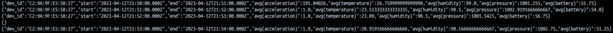

<p align="center">

# 1 - Design for streaming analytics 

### 1.1 As a tenant, select a dataset suitable for streaming data analytics as a running scenario. Explain the dataset and why the dataset is suitable for streaming data analytics in your scenario. As a tenant, present at least two different analytics in the interest of the tenant: (i) a streaming analytics (tenantstreamapp) which analyzes streaming data from the tenant and (ii) a batch analytics, using the workflow model, which analyzes historical results outputted by the streaming analytics. The explanation should be at a high level to allow us to understand the data and possible analytics so that, later on, you can implement and use them in answering other questions.

For tenant's dataset i will continue using IoT data from Korkeasaari Zoo tortoises. Their data is continuously generated by IoT -devices attached to turtles providing information on tortoises' behaviour and environment. Their timestamped data can be received as a stream in real time and processed to provide for excample analytics on their environment therefore providing benefit to a tenant who might be concerned on tortoises well being, e.g. make sure that temperature or anything else is out of order at the zoo. Tortoises are demanding creatures regarding their environment, thus real time analytics are required.

Features such as 3D acceleration can be analyzed in real time to analyze movement and behaviour of tortoises in the zoo, in a streaming manner, or recent temperature changes to alert the tenant, while more sophisticated information can be extracted from historical data batch analytics, for example to determine the most movement active tortoises species, or seasonal changes in tortoises activity.

A samle data row:
```
time	readable_time	acceleration	acceleration_x	acceleration_y	acceleration_z	battery	humidity	pressure	temperature	dev-id
1522826433358	2018-04-04T07:20:33.358000Z	1009.8237469974649	-104	332	948	3007	20	1009.91	35.24	C2:9A:9F:E5:58:27

```
### 1.2  The tenant will send data through a messaging system, which provides stream data sources. Discuss, explain and give examples for the following aspects for the streaming analytics: (i) should the streaming analytics handle keyed or non-keyed data streams for the tenant data, and (ii) which types of delivery guarantees should be suitable for the stream analytics and why.

Tenant's dataset contains data with device-ID of the device which produced the data, assuming that we want to have analytics such as presented in 1.1, we would prefer keyed streams in order to group data by the ID's, thus having insight on each separate tortoise. If we didn't care about this type of analytics such as presented in 1.1, and for example only wanted to calculate average temperatures of all the IoT devices at the zoo, we wouldn't care about individual tortoises, and keying stream by device-ID's wouldn't be necessary. If we used non keyed streams and still wanted to provide analytics presented in 1.1 our architecure would then have unnecesary overhead to additionally collect a subset from all the data generated through filtering, with keyed stream, we can work on the subsed upon its arrival.
  
Regarding the delivery guarantees the data is generated every 5 seconds, and regarding the metrics environment and movement having extremely large time-resolution is not that important for the tenant, since environment variables do not change too quicly and tortoises are slow animals. Additionally, very similar data will be produced with the next timestamp, so it can be easily extrapolated in between, since fields of such IoT data remain the same we can safely let the broker drop the packages. Therefore *at most once* for delivery guarantee is suitable. At least once would produce a little additional overhead on message acknowledgement and we would have to bother to remove dublicates based on timestamp (for example if we didnt do that and tosrtoise acceleration was at that moment high if it was falling, and the message was dublica the calculated average acceleration for 10 seconds woudl be incorrect), exactly once produces even more overhed wich is not necessary for our data.
  
### 1.3 Given streaming data from the tenant (selected before). Explain the following issues: (i) which types of time should be associated with stream data sources for the analytics and be considered in stream processing (if the data sources have no timestamps associated with events, then what would be your solution), (ii) which types of windows should be developed for the analytics (if no window, then why), (iii) what could cause out-of-order data/records with your selected data in your running example, and (iv) will watermarks be needed or not, explain why. Explain these aspects and give examples.

The dataset provides two times "time" time in tenants own standard and "readable" time in a generally accepted standard. Both of them represent the time, when the data was generated, so we can use it as a timestamp. For performance analytics we can use that timestamp and calculate the latency of message broker and consumer by associating a row with another time stamp upon receival. If the data source didn't have any timestamp we would need to assume latency separately and add it in processing stage: current-time - latency = approximate time of data generated, but designer needs to remember tahat delivery guarantee of exatctly once would be more suitable here.
  
Depending on the knowledge that we want to extract from the data we might want or not to use windowing. For example if we want to extract average temperature or any other metric over a period of time we could use a sliding window of 5 minutes to gather data and calculate averages for the metrics. Tumbling window would not be acceptable for this type of analysis. If we want to stream instantaneous movement data of the tortoise, then there is no use of windowing. 

Device malfunction or network issues or prblems in mysimbdp could result in data to be sent/received out of order. This will create problems on data processing side, especially if the data didnt have any timestamp, resulting in incomplete data processing. Luckily the data has timestamps, so we can counter these issues on processing stage.
  
When creating a time window a watermark on the data is used to collect the data based on data's timestamp, not the system time of the data processor, this is not only smarter since we have a timestamp in the data, but it will also help to counter problems mentioned above. 
```
    df \
    .withWatermark("readable_time", "5 minutes") \
    .groupBy(window("readable_time", "5 minutes"), "dev_id") \
    ...
```
### 1.4 List performance metrics which would be important for the streaming analytics for your tenant cases. For each metric, explain its definition, how to measure it in your analytics/platform and why it is important for the analytics of the tenant (for whom/component and for which purposes).

Since tenant is paying for the service of mysimbdp, the tenant is interested in receiving metrics such as stream latency (the delay of data sent - data received), and throughput (amount of data processed/time, in our case, number of rows processed per window time, 1 minute in the implementation: please see see tenantsreamapp code) of the data processing service. For development and maintenance tenant is also interested in receiving information if any errors occur: if wrong data for example is sent or data is such that it can't be interpreted by the processing service, then tenanstreamapp should notify tenant's application about that.
  
### 1.5 Provide a design of your architecture for the streaming analytics service in which you clarify: tenant data sources, mysimbdp messaging system, mysimbdp streaming computing service, tenant streaming analytics app, mysimbdp-coredms, and other components, if needed. Explain your choices of technologies for implementing your design and reusability of existing assignment works. Note that the result from tenantstreamapp will be sent back to the tenant in near real-time and to be ingested into mysimbdp-coredms
  
In mysimbdp, tenant's data producer (device) streams data through DAAS and its API that sends data to Nifi's Kafka connector. Kafka connector authenticates and sends data to Kafka mysimbdp messaging system in clients according topic. Then the data is consumed by the tenantstreamapp in Apache Spark job that contains the logic for processing and analytics. The processed output data is then fed back through kafka tenants output data topic to the DAAS for the tenant to consume output jsons through it's API from all the output topics including warn topic that warns tenant, whenever errors occur or environment is bad for the tortoise. Apache Spark job also connects to mysimbdp-coredms through pyspark's cassandra connector and ingests the processed data (excluding warn topic) into tenant's keyspace's processed table if required. 

# 2 - Implementation of streaming analytics
  
### 2.1 As a tenant, implement a tenantstreamapp. For code design and implementation, explain (i) the structures/schemas of the input streaming data and the analytics output result in your implementation, the role/importance of such schemas and the reason to enforce them for input data and results, and (ii) the data serialization/deserialization, for the streaming analytics application (tenantstreamapp)

I have implemented tenantsreamapp with pyspark. For the korkeasaari data a schema looks like this:
  
```
# define the schema for the incoming data
schema = StructType([
    StructField("time", StringType()),
    StructField("readable_time", TimestampType()),
    StructField("acceleration", DoubleType()),
    StructField("acceleration_x", DoubleType()),
    StructField("acceleration_y", DoubleType()),
    StructField("acceleration_z", DoubleType()),
    StructField("battery", IntegerType()),
    StructField("humidity", IntegerType()),
    StructField("pressure", DoubleType()),
    StructField("temperature", DoubleType()),
    StructField("dev_id", StringType())
])
```
The schema defines data types for the columns of stream dataframe that is used to query, aggregate and calculate data from stream. It also makes sure that data that is sent is correct, for example if wrong data is sent the fields of schema with wrong data the row's field will be null, for which i test in dataframes, this helps us with validation of data quality.

  
The data in stream is in json format, so we need to deserializre it casting it into a string and then using to_json method passing the schema structure.
```
# read binary data from Kafka
df = spark \
    .readStream \
    .format("kafka") \
    .option("kafka.bootstrap.servers", "kafka:9092") \
    .option("subscribe", "tenant1-data") \
    .load()

# convert the value column to string and decode it as json according to schema
df = df \
.select(
    from_json(
        decode(col("value"), "utf-8"),
        schema
    ).alias("value")
)
```
I then do the necessary processing for the dataframes and add new columns for the extracted data of interest, this data is then converted to json and sent to kafka using pyspark's methods. Since we have multiple types of analytics of interest, we also have two kafka topics to write to: tenant1-warn for warning when environment is not ok for tortoise and warning when data is wrong (an empty json is sent) or some error happened and tenant1-output data for outputting processed data (calculated averages). The data is serialised back using pyspark's methods, just lice deserealization part.
  
  
```
# Check for null values in time column (wrong data), if data is incorrect, then warn tenant by sending to warn topic
df_null = df.filter(col("time").isNull() | col("readable_time").isNull() | col("acceleration").isNull | col("dev_id").isNull() | col("battery").isNull() | col("pressure").isNull() | col("temperature").isNull() | col("humidity").isNull() | col("acceleration_x").isNull() | col("acceleration_y").isNull() | col("acceleration_z").isNull())
query_warn_null = df_null \
    .selectExpr("CAST(dev_id AS STRING) AS key", "to_json(struct(*)) AS value") \
    .writeStream \
    .format("kafka") \
    .option("kafka.bootstrap.servers", "kafka:9092") \
    .option("topic", "tenant1-warn") \
    .option("checkpointLocation", "/tmp/kafka-checkpoint-null") \
    .start()
  
# define the windowing, calculate the averages of the data
windowedAvg = df \
    .withWatermark("readable_time", "1 minutes") \
    .groupBy(window("readable_time", "1 minutes"), "dev_id") \
    .agg(avg("temperature"), avg("humidity"), avg("acceleration"), avg("pressure"), avg("battery"), max("readable_time").cast("long").alias("max_readable_time"), count("*").alias("count")) \
    .select("window.start", "window.end", "avg(acceleration)", "avg(temperature)", "avg(humidity)", "avg(pressure)", "avg(battery)", "max_readable_time", "count", col("dev_id").alias("dev_id"))

# calculate the latency and throughput
outputData = windowedAvg \
    .withColumn("latency", (col("max_readable_time") - unix_timestamp(col("start"))) / 1000) \
    .withColumn("throughput", col("count") / 60)

# Test if environment variables are ok, if not, send to warn topic
df_environment_warn = windowedAvg.filter(
    (col("avg(temperature)") > 30) | (col("avg(temperature)") < 20) |
    (col("avg(humidity)") < 90) |
    (col("avg(battery)") < 5) |
    (col("avg(pressure)") > 1000) | (col("avg(pressure)") < 900)) \
        .select(to_json(struct(col("dev_id"), col("start"), col("end"), col("avg(acceleration)"), col("avg(temperature)"), col("avg(humidity)"), col("avg(pressure)"),  col("avg(battery)"))).alias("value"))

query_warn = df_environment_warn \
    .writeStream \
    .format("kafka") \
    .option("kafka.bootstrap.servers", "kafka:9092") \
    .option("topic", "tenant1-warn") \
    .option("checkpointLocation", "/tmp/kafka-checkpoint") \
    .start()

# write the output to the data-output topic to the tenant 
query = outputData \
    .select(to_json(struct(col("dev_id"), col("start"), col("end"), col("avg(acceleration)"), col("avg(temperature)"), col("avg(humidity)"), col("avg(pressure)"),  col("avg(battery)"), col("latency"), col("throughput"))).alias("value")) \
    .writeStream \
    .format("kafka") \
    .option("kafka.bootstrap.servers", "kafka:9092") \
    .option("topic", "tenant1-data-output") \
    .option("checkpointLocation", "/tmp/kafka-checkpoint") \
    .start()
                                                                 
# wait for the streams to finish
query.awaitTermination()
query_warn.awaitTermination()
query_warn_null.awaitTermination()
```
### 2.2 Explain the key logic of functions for processing events/records in tenantstreamapp in your implementation. Explain under which conditions/configurations and how the results are sent back to the tenant in a near real time manner and/or are stored into mysimbdp-coredms as the final sink.
                                                                 
The key logic of data processing in code above is that it tests for occurrence of null's in case of wrong data being sent, for another dataframe i test if environmental variables are suitable for the tortoise, in the main df, i declare a 1-minute sliding window with watermark and calculate average values for temperature, humidity, acceleration etc. and aggregate them by dev-id. Then the main dataframes data is every minute sent back to tenant's topic consumed by daas, i decided not to implement coredms ingestion, but it is as simple as writing to kafka with pyspark's functionality. When environmental metrics don't comply with supposed healthly environment for tortoise, i send them to another kafka topic which warns the tenant when he consumes it from daas with their application. When data is wrong an empty json is sent there.

### 2.3 Explain a test environment for testing tenantstreamapp, including how you emulate streaming data, configuration of mysimbdp and other relevant parameters. Run tenantstreamapp and show the operation of the tenantstreamapp with your test environments. Discuss the analytics and its performance observations when you increase/vary the speed of streaming data.

In my test environment i deploy required containers, a kafka with zookeeper and their required topics and spark master with one spark working node (with more for thesting parallelism). To emulate streaming data i implemented a simple kafka producer with python that emulates data such as at korkeasaari zoo:

```
import json
import time
import calendar
import datetime
import random
from bson import json_util
from kafka import KafkaProducer


producer = KafkaProducer(bootstrap_servers='localhost:9093')

#time,readable_time,acceleration,acceleration_x,acceleration_y,acceleration_z,battery,humidity,pressure,temperature,dev-id
#1522826433358,2018-04-04T07:20:33.358000Z,1009.8237469974649,-104,332,948,3007,20,1009.91,35.24,C2:9A:9F:E5:58:27

for i in range(100000):
    if i == 3: # emulate "wrong data"
        data = {
        'wrong_device': 'absolutely wrong data'
        }
    else:
        data = { # <----- sometimes rand's will generate unsuitable environment for the tortoise
            'time': calendar.timegm(time.gmtime()),
            'readable_time' : datetime.datetime.now().isoformat(),
            'acceleration' : round(random.uniform(0,1000),5),
            'acceleration_x': round(random.uniform(-1000,1000),1),
            'acceleration_y': round(random.uniform(-1000,1000),1),
            'acceleration_z': round(random.uniform(-1000,1000),1),
            'battery': random.randint(0,100),
            'humidity': random.randint(97,100),
            'pressure': round(random.uniform(999,1005),2),
            'temperature': round(random.uniform(15,31),2),
            'dev_id': 'C2:9A:9F:E5:58:27'
            }
    producer.send('data', json.dumps(data, default=json_util.default).encode('utf-8'))

    #time.sleep(5) # turn off for extremely fast data speed.
```

Warn topic consumer, where data is sent as alarm when environment is not ok, and wrong data is sent, note emty json { }:
<p align="center">

